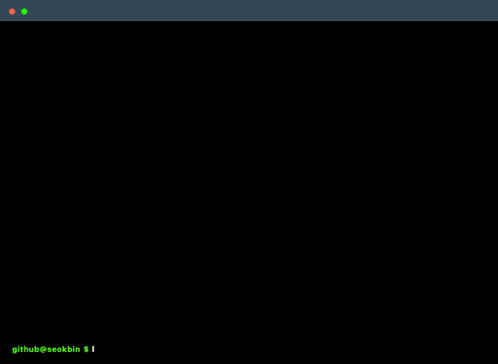

# Seokbin Lee

 

 

<table>
  <tr>
    <td width="33%" valign="top">

### About
Building products, systems, and tools with a focus on execution, clarity, and iteration.

    </td>
    <td width="33%" valign="top">

### Focus
- Web services
- Automation
- System design
- Product building

    </td>
    <td width="33%" valign="top">

### Contact
- [GitHub](https://github.com/seokbin-cloud)
- [Email](mailto:seokbin.cloud@gmail.com)
- [Portfolio](https://YOUR_PORTFOLIO_LINK)

    </td>
  </tr>
</table>

 

## Selected Work

**Project One**  
A short sentence describing what it does.  
[Repository](https://github.com/seokbin-cloud/PROJECT_ONE) · [Live](https://YOUR_PROJECT_ONE_DEMO)

 

**Project Two**  
A short sentence describing what it does.  
[Repository](https://github.com/seokbin-cloud/PROJECT_TWO) · [Live](https://YOUR_PROJECT_TWO_DEMO)

 

**Project Three**  
A short sentence describing what it does.  
[Repository](https://github.com/seokbin-cloud/PROJECT_THREE) · [Live](https://YOUR_PROJECT_THREE_DEMO)
